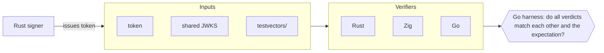

# identity-provider

A home-rolled OAuth 2.0 / OpenID Connect identity provider, written in Rust, Zig and Go.

> **Educational project. Not production-ready. Do not deploy.**
> This exists to learn the protocols by implementing them, and to compare independent
> implementations of the same security-critical code. It has had no external review.
> For real systems, use an audited identity provider.

## Why this exists

Most identity code is written against libraries. This project builds the layers
underneath (JOSE, token issuance, verification, the OAuth/OIDC flows) by hand, and
splits them across three languages so each does the work it is best suited for.
The more interesting goal is **differential testing**: the same token verifier is
implemented more than once, and a shared set of test vectors makes any
disagreement between implementations visible.

## Status

| Milestone | Scope | Status |
|---|---|---|
| **M0** | JOSE: JWS signing and verification, JWK/JWKS, thumbprints, shared test vectors | In progress |
| M1 | OAuth 2.0 authorization code flow with PKCE | Planned |
| M2 | OpenID Connect: ID tokens, discovery, userinfo | Planned |
| M3 | Token lifecycle: refresh rotation, introspection, revocation, key rotation | Planned |
| M4 | Hardening: PAR, DPoP, RFC 9700 checklist | Planned |
| M5 | Authentication: Argon2id passwords, TOTP, WebAuthn | Planned |
| M6 | Control plane: admin API, dynamic client registration, SCIM 2.0 | Planned |
| M7 | Federation: OIDC relying-party connector, LDAP gateway | Planned |
| M8 | Assurance: OpenID conformance suite, attack harness, fuzzing in CI | Planned |

This README describes the intended design. Sections marked are not
implemented yet.

## Architecture

| Language | Component | Why this language |
|---|---|---|
| **Rust** | Authorization server core and the JOSE signer | Type-state modelling of protocol rules, `forbid(unsafe_code)`, `zeroize` for key material |
| **Zig** | JOSE/JWT verification library with a C ABI, plus a small edge-auth sidecar | Explicit allocators, small static binaries, easy cross-compilation |
| **Go** | Control plane and the cross-implementation test harness | Strong networking stdlib, Kubernetes and Terraform tooling, built-in fuzzing |



## M0 scope

What the JOSE layer supports:

| Item | Support |
|---|---|
| JWS compact serialization | Yes |
| `EdDSA` (Ed25519) | Yes, the default |
| `ES256` (ECDSA P-256) | Yes |
| `HS256` | Verification only, to pass the RFC vector. Never enabled by default |
| `RS256` | Rust only, stretch goal. Not implemented in Zig |
| JWE, JWS JSON serialization | Out of scope |
| JWK / JWKS (`OKP`, `EC` public keys; `oct` for HS256 verification only) | Yes |
| JWK thumbprint (RFC 7638), used as `kid` | Yes |
| Claims validation (`iss`, `aud`, `exp`, `nbf`, `typ`) | Yes |

See [`docs/rfc-conformance.md`](docs/rfc-conformance.md) for the full list of
implemented and deliberately skipped RFC sections.

## Repository layout

- `docs/`
  - `threat-model.md`
  - `rfc-conformance.md`
  - `adr/`: architecture decision records
- `testvectors/`
  - `schema.json`
  - `rfc/`: cases copied from the RFCs
  - `generated/`: cases produced by `jose-cli gen-vectors`
- `rust/`: Cargo workspace with the `jose` library and `jose-cli`
- `zig/`: verifier library, C header, CLI
- `go/`: differential test harness
- `.github/workflows/ci.yml`

## Getting started

Prerequisites:

- Rust (stable)
- Zig, at the version pinned in `zig/build.zig.zon` (Zig is pre-1.0 and its standard library changes between releases)
- Go

## The CLI contract

The Rust and Zig command-line tools expose the same interface, which is what the
harness relies on.

```bash
jose-cli verify --jwks keys.json --policy policy.json < token.txt
```

- The token is read from stdin.
- Stdout is exactly one line of JSON: `{"ok":true,"kid":"...","alg":"EdDSA"}` or `{"ok":false,"error":"expired"}`.
- Exit code `0` means accepted, `1` rejected, `2` usage error. A crash is reported separately by the harness.

Example `policy.json`:

```json
{
  "iss": "https://idp.example",
  "aud": "https://api.example",
  "algs": ["EdDSA", "ES256"],
  "now": 1700000000,
  "leeway": 30,
  "typ": "at+jwt",
  "max_token_bytes": 8192
}
```

`now` is explicit so that expiry tests do not depend on the wall clock.

Other `jose-cli` subcommands: `keygen`, `jwks`, `sign`, `gen-vectors`.

## Verification rules

Every verifier checks in the same order and returns the same error code, so that
implementations can be compared exactly:

1. Token size is within `max_token_bytes` (`too_large`)
2. Exactly three dot-separated segments (`malformed`)
3. Header decodes as strict base64url, no padding (`malformed`)
4. Header parses as JSON with no duplicate keys (`malformed`)
5. Unknown `crit` entries are rejected (`crit_unsupported`)
6. `alg` must be in the policy allowlist, never taken from the token's own preference (`alg_not_allowed`)
7. `typ` matches the policy, if one is set (`typ_mismatch`)
8. Key found by `kid`, and the key's declared `alg` equals the header's (`key_not_found`)
9. Signature verifies over `header.payload` (`bad_signature`)
10. Payload decodes and parses (`malformed`)
11. `iss` matches exactly (`wrong_issuer`)
12. `aud` contains the expected audience (`wrong_audience`)
13. `exp` and `nbf` hold, allowing the configured leeway (`expired`, `not_yet_valid`)

`jku`, `x5u` and embedded keys in the header are never followed or trusted.
The reasoning for the ordering is recorded in
[`docs/adr/0003-verifier-check-order.md`](docs/adr/0003-verifier-check-order.md).

## Test vectors

`testvectors/` is the contract between the implementations. Each case is a JSON
file holding a JWKS, a policy, a token and the expected verdict.

- **`rfc/`**: positive cases taken from the specifications: RFC 7515 Appendix A
  (HS256, ES256), RFC 8037 Appendix A (Ed25519), RFC 8032 section 7.1 (raw Ed25519
  signatures) and RFC 7638 section 3.1 (thumbprint).
- **`generated/`**: negative cases produced by mutating a valid token: `alg: none`,
  algorithm confusion, tampered payload or signature, unknown `kid`, expired and
  not-yet-valid tokens, wrong issuer or audience, missing `typ`, unknown `crit`,
  base64url padding and alphabet violations, duplicate JSON keys, oversized
  headers, and a `jku` pointing at an attacker-controlled URL.

Ed25519 signatures are deterministic, so the Rust signer must reproduce the RFC
signature byte for byte. ES256 signatures are randomized, so the RFC vector is
only verified, and signing is tested by round trip.

## Zig C ABI

The Zig library will export a C interface so other languages can link it:

```c
jose_verifier *jose_verifier_new(const uint8_t *jwks, size_t jwks_len, const uint8_t *policy, size_t policy_len);
int  jose_verify(jose_verifier *v, const uint8_t *token, size_t len, jose_result *out);
void jose_verifier_free(jose_verifier *v);
```

The header will live at `zig/include/jose.h`.

## Security notes

- This is a learning project. Treat every component as unreviewed.
- Cryptographic primitives (hashes, Ed25519, ECDSA, HMAC) come from vetted libraries (`ring` in Rust, `std.crypto` in Zig, the standard library in Go). Only the JOSE layer and above is written here.
- SAML is deliberately not implemented. XML signature handling is a historically
  error-prone area and not a good fit for a from-scratch project.
- Please report suspected vulnerabilities by opening an issue. There is nothing here to keep private.

## Non-goals

- Production deployment or any form of support
- Full JOSE coverage (JWE, JSON serialization, every algorithm)
- SAML
- Competing with existing identity providers

## References

- RFC 6749: OAuth 2.0
- RFC 7515, 7517, 7518: JWS, JWK, JWA
- RFC 7636: PKCE
- RFC 7638: JWK thumbprint
- RFC 8032, 8037: EdDSA and its use in JOSE
- RFC 8725: JWT best current practices
- RFC 9068: JWT profile for OAuth 2.0 access tokens
- RFC 9700: OAuth 2.0 security best current practice
- OpenID Connect Core 1.0
